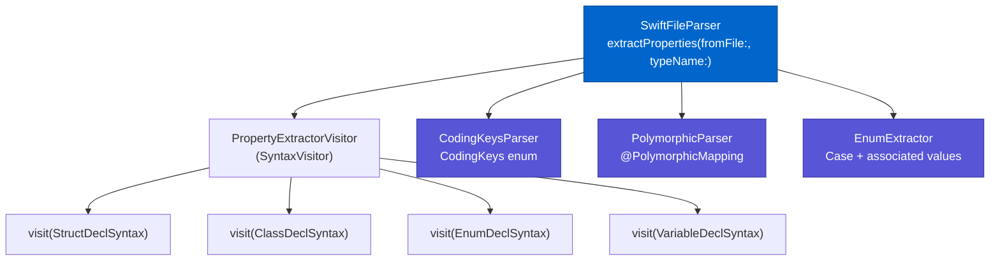
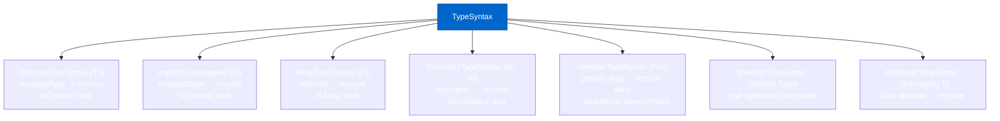
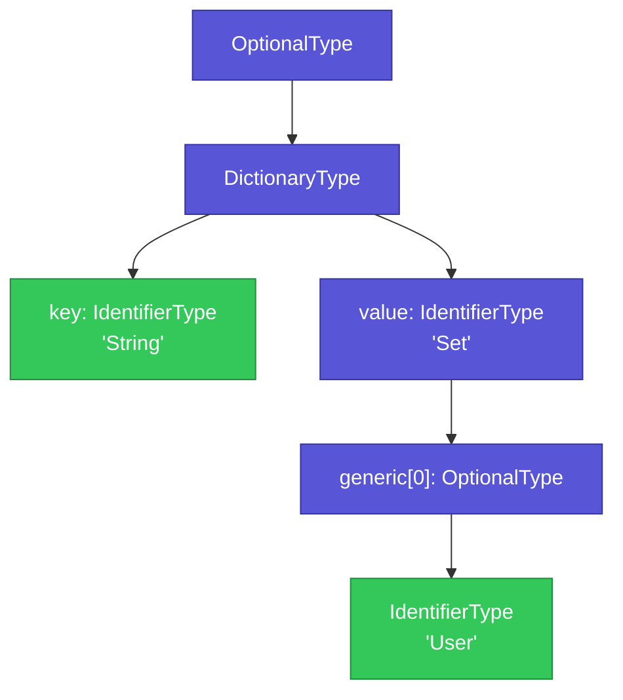

# AST Parsing

Phase 2 of the pipeline transforms raw Swift source files into structured property data using **SwiftSyntax** — Apple's official Swift parser that produces a full Abstract Syntax Tree (AST).

## Why AST (Not Regex)?

IndexStoreDB tells us _where_ a symbol is declared, but not _what properties it contains_. Regex could extract simple cases but fails on:

- Generic types: `[String: Set<User?>]`
- Optional nesting: `Array<Optional<Address>>`
- Enum cases with labeled associated values
- Computed vs stored property distinction

SwiftSyntax parses the _exact same AST_ that the Swift compiler uses, giving us full fidelity.

## Parser Components



## PropertyExtractorVisitor

A `SyntaxVisitor` subclass that walks the AST and collects stored properties from the target type.

### Scope tracking

The visitor maintains a scope stack to avoid capturing properties from _nested_ types:

```swift
// File contains:
struct Order {          // target type
    let id: String      // ← captured

    struct LineItem {   // nested — NOT the target
        let sku: String // ← ignored
    }
}
```

Implemented via `insideTargetType: Bool` and `scopeDepth: Int` counters. The visitor only records properties when `insideTargetType == true && scopeDepth == 1`.

### Property filtering

Not every `var` is a stored property:

| Declaration | Included? | Reason |
|-------------|:---------:|--------|
| `let name: String` | ✓ | Stored constant |
| `var age: Int` | ✓ | Stored variable |
| `var age: Int = 0` | ✓ | Stored with default |
| `static var count = 0` | ✗ | Static |
| `class var shared = ...` | ✗ | Class-level |
| `var full: String { firstName + " " + lastName }` | ✗ | Computed |
| `var count: Int { get { … } set { … } }` | ✗ | Custom accessor |
| `var count: Int { didSet { … } }` | ✓ | Observer (still stored) |

### Type extraction — recursive pattern matching

`extractTypeInfo(from: TypeSyntax)` handles every Swift type wrapper:



**Example**: `[String: Set<User?>]?`



**Result:**
```json
{
  "typeName": "User",
  "isDictionary": true,
  "isSet": true,
  "isOptional": true,
  "genericTypes": ["String", "User"]
}
```

## CodingKeysParser

Extracts custom JSON key mappings so the schema uses the correct wire names, not Swift property names:

```swift
struct User: Codable {
    let firstName: String

    enum CodingKeys: String, CodingKey {
        case firstName = "first_name"
    }
}
```

`CodingKeysParser` returns `["firstName": "first_name"]`. Properties without an entry keep their Swift name.

## PolymorphicParser

Reads `@PolymorphicMapping` annotations to extract discriminator configuration:

```swift
@PolymorphicMapping(
    discriminator: "type",
    variants: ["credit": CreditPayment.self, "upi": UPIPayment.self]
)
let payment: Payment
```

Returns:

```swift
PolymorphicMapping(
    discriminatorKey: "type",
    variants: ["credit": "CreditPayment", "upi": "UPIPayment"]
)
```

The parser tries SwiftSyntax first, falls back to regex for reliability.

## EnumExtractor

Enums are extracted separately because they don't have _stored properties_ — they have _cases_:

```swift
enum Status: String {
    case active  = "ACTIVE"
    case pending = "PENDING"
    case failed(code: Int, message: String)
}

// Extracted:
[
    EnumCaseInfo(name: "active",  rawValue: "ACTIVE",  associatedValues: []),
    EnumCaseInfo(name: "pending", rawValue: "PENDING", associatedValues: []),
    EnumCaseInfo(name: "failed",  rawValue: nil,        associatedValues: ["Int", "String"]),
]
```

## TypeAnalyzer

A utility that classifies any type string so the graph builder knows whether to recurse into it:

```swift
TypeAnalyzer.classify("String")           // .primitive   → skip
TypeAnalyzer.classify("User")             // .custom      → recurse
TypeAnalyzer.classify("[User]")           // .array("User") → recurse element
TypeAnalyzer.classify("User?")            // .optional("User") → recurse wrapped
TypeAnalyzer.classify("Set<User>")        // .set("User")  → recurse element
TypeAnalyzer.classify("[String: User]")   // .dictionary → recurse value
TypeAnalyzer.classify("T")               // .genericPlaceholder → skip
```

Primitive types include all Swift built-ins (`Int`, `Double`, `String`, `Bool`, `Date`, `URL`, `Data`, …) and Foundation types. System framework types (`UIImage`, `CGRect`, …) are also skipped.
