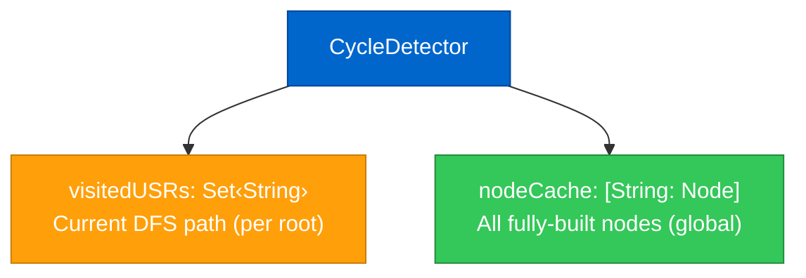
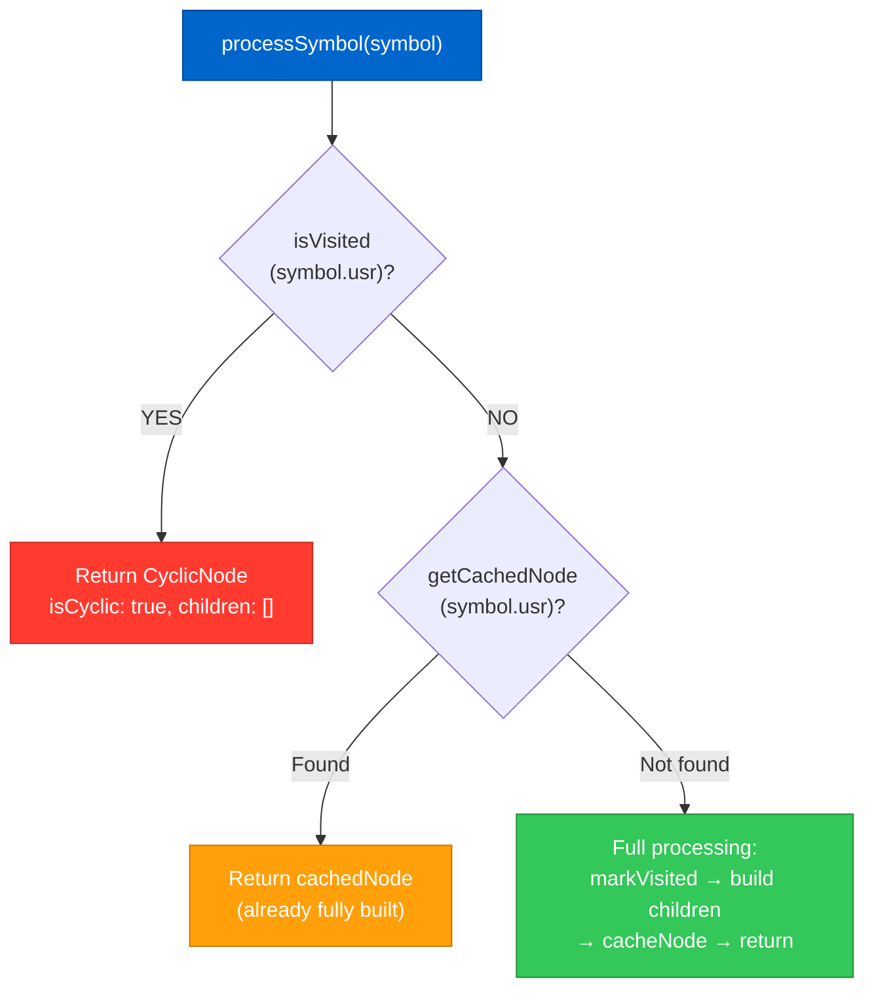
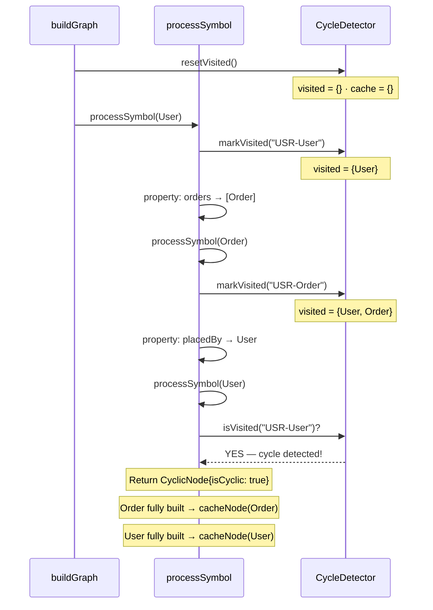
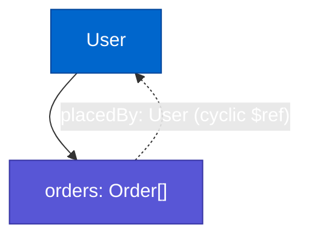
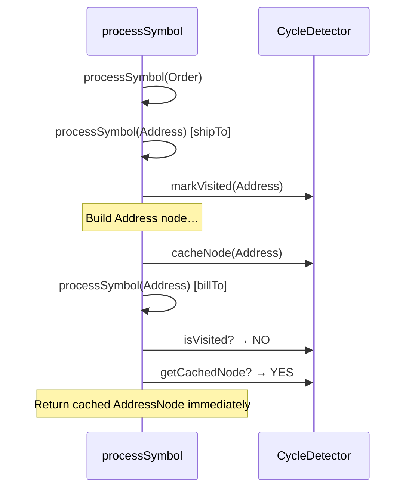

# Cycle Detection

Real-world Swift models frequently contain circular references — a `User` owner that holds `Order` records, which in turn reference the `User` who placed them. Without explicit cycle detection, the graph builder would recurse infinitely.

ModelGraphGenerator uses a **two-level state strategy** inside `CycleDetector` to handle this correctly without losing type information.

## Two-Level State



| | `visitedUSRs` | `nodeCache` |
|---|---|---|
| **Scope** | Current DFS path | Entire graph build |
| **Reset?** | Yes — between roots | No — persists forever |
| **Purpose** | Cycle detection | Work deduplication |

## Decision Tree

Every time `processSymbol` is called, `CycleDetector` is consulted:



## Worked Example — Mutual Reference

```swift
struct User {
    let orders: [Order]
}

struct Order {
    let placedBy: User    // ← back-reference
}
```

### Step-by-step trace



**Resulting ModelGraph:**



## Worked Example — Shared Type (Diamond)

```swift
struct Order {
    let shipTo:   Address
    let billTo:   Address
}
```



Both `shipTo` and `billTo` point to the _same_ `ModelNode` object — no duplicate work, no duplicate `$defs` entry.

## Cyclic Node in JSON Schema

When the converter encounters `isCyclic: true`, it emits a `$ref` pointing back to the already-defined `$defs` entry rather than inline-expanding the type:

```json
"placedBy": {
  "$ref": "#/$defs/User"
}
```

This produces valid, non-recursive JSON Schema that validators can process without infinite loops.

## Edge Cases

### Self-referential types

```swift
struct TreeNode {
    let children: [TreeNode]   // ← self-reference
}
```

Handled identically: on the recursive call with `TreeNode`'s USR, `isVisited` returns `true` immediately, emitting a `$ref` back to `#/$defs/TreeNode`.

### Protocol-backed polymorphism

Polymorphic variants are processed at a _higher_ recursion frame before the main property recursion. Each variant gets its own `markVisited` / `cacheNode` cycle, but they are processed as siblings rather than as nested children, so a variant referencing the parent root does not create a false cycle.

### Generic types

Generic placeholder types (`T`, `U`, `Element`) are classified as `genericPlaceholder` by `TypeAnalyzer` and are **skipped entirely** — they never enter the cycle detector because they cannot be resolved to a concrete symbol.
