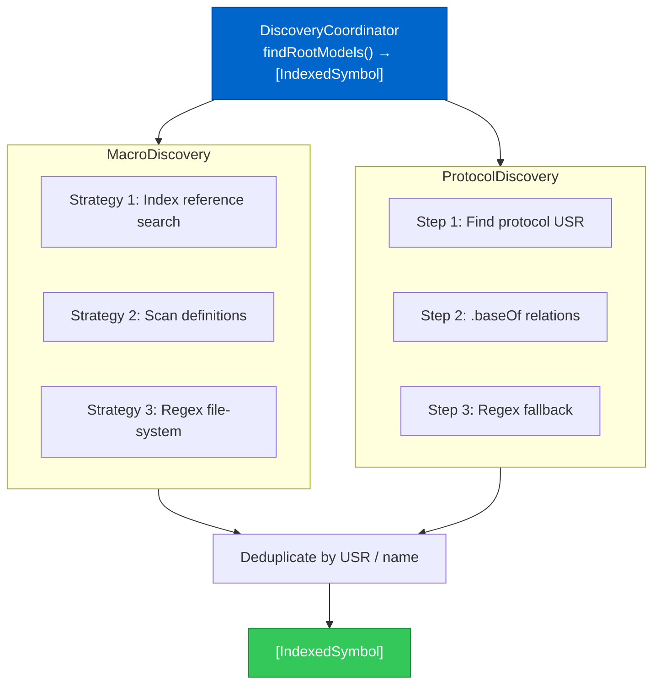
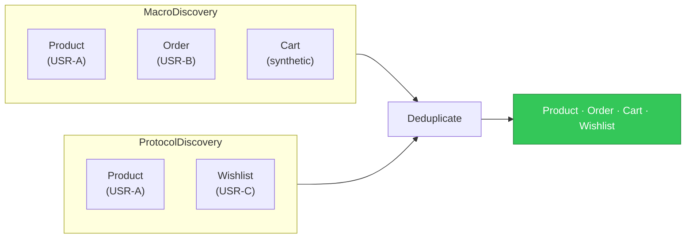

# Discovery System

The **Discovery** phase is Phase 1 of the pipeline: it finds every Swift type that should become a root node in the graph. ModelGraphGenerator supports two complementary marker strategies — **macro annotations** (`@ChimeraSchema`) and **protocol conformance** (`RootModel`) — and combines results from both.

## Architecture



## MacroDiscovery — Three-Strategy Approach

Because macro indexing in Xcode's IndexStoreDB is not always complete (it depends on whether the project has been built), `MacroDiscovery` tries three strategies in order, merging unique results:

### Strategy 1 — Index Reference Search

Query the symbol index for occurrences of `@ChimeraSchema` used as a _reference_. From each reference location, search for the `struct` / `class` definition within ±3 lines.

```
@ChimeraSchema         ← reference occurrence at line 12
struct Product {   ← definition at line 13  ✓
```

**Limitation**: Requires an up-to-date index build.

### Strategy 2 — Definition Scan + Source Check

Iterate every `struct` / `class` definition in the index, read the actual source file, and check lines `[nearLine-5 … nearLine+1]` for the `@ChimeraSchema` token.

**Advantage**: Works even when macro references aren't indexed, because it reads source files directly.

### Strategy 3 — File-System Regex (Primary)

Walk every `.swift` file under `--source-path` and apply a regex:

```
@ChimeraSchema\s*(\([^)]*\))?\s*\n?\s*(public\s+|internal\s+|...)?
(struct|class|enum)\s+(\w+)
```

This is the most reliable fallback — it finds `@ChimeraSchema` annotations regardless of index freshness or build state.

## ProtocolDiscovery — Three-Step Approach

### Step 1 — Find Protocol USR

```
indexStore.forEachCanonicalSymbolOccurrence(
    containing: "RootModel", anchorStart: true, anchorEnd: true
) { occurrence in
    if occurrence.symbol.kind == .protocol { capture USR }
}
```

The **USR** (Unified Symbol Resolution) is the stable identifier Xcode assigns to every declaration — e.g. `s:7MyApp9RootModelP`.

### Step 2 — Query `.baseOf` Relations

```
indexStore.forEachSymbolOccurrence(byUSR: protocolUSR, roles: .baseOf) {
    // occurrence.location = where "struct Product: RootModel" is written
    findTypeAtLocation(file, line) → IndexedSymbol
}
```

The `.baseOf` relationship maps a protocol to all types that conform to it.

### Step 3 — Regex Fallback

If the index doesn't have conformance data (e.g. fresh checkout, never built):

```swift
let pattern = #"(struct|class)\s+(\w+)\s*:\s*[^{]*\bRootModel\b"#
// Matches: struct User: RootModel
//          class Org:   Codable, RootModel
```

## Deduplication

Results from both services are merged by `DiscoveryCoordinator`. A symbol is considered a duplicate if its **USR** matches an already-seen symbol, or (for synthetic symbols without USR) if the **name + file** pair matches.



## IndexedSymbol

The output of discovery — a lightweight handle pointing to a Swift declaration:

```swift
struct IndexedSymbol {
    let name: String   // "Product"
    let usr:  String   // "s:7MyApp7ProductV"  (empty for synthetic)
    let path: String   // "/src/Models/Product.swift"
    let line: Int      // 14
    let kind: Kind     // .struct | .class | .enum
}
```

## Why Two Strategies?

| Situation | Macro works? | Protocol works? |
|-----------|:-----------:|:---------------:|
| Project never built | ✓ (regex) | ✓ (regex) |
| Project built once | ✓ (all 3) | ✓ (all 3) |
| Index stale | ✓ (regex) | ✓ (regex) |
| Large monorepo, partial build | ✓ (regex) | ~ partial |

Using both strategies ensures the widest coverage regardless of build state.
