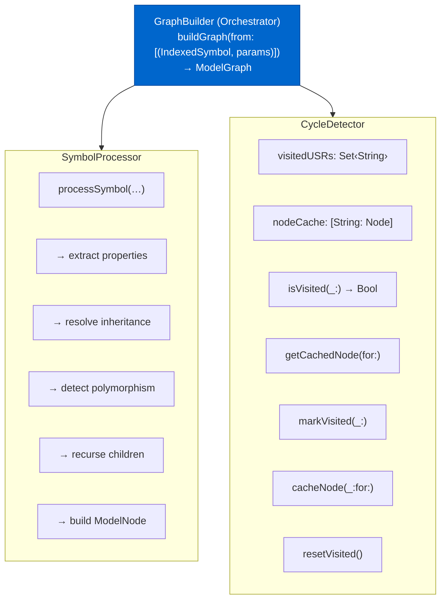
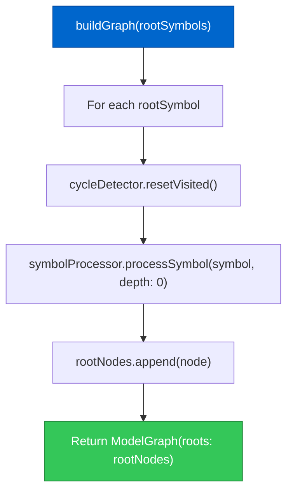
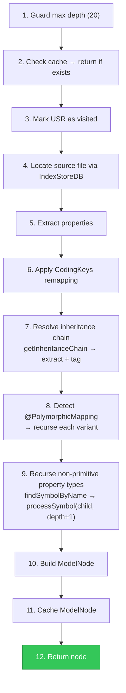
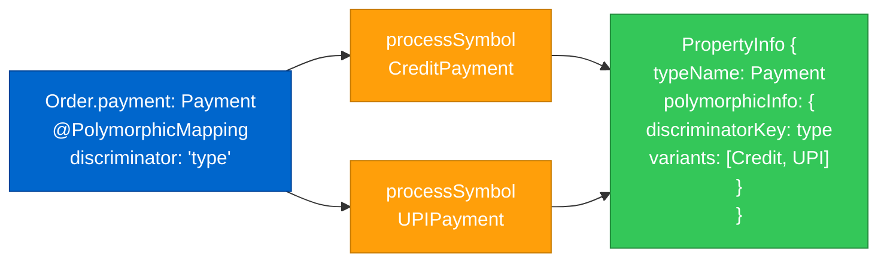
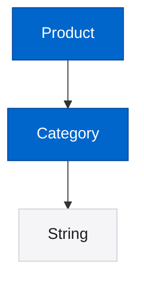
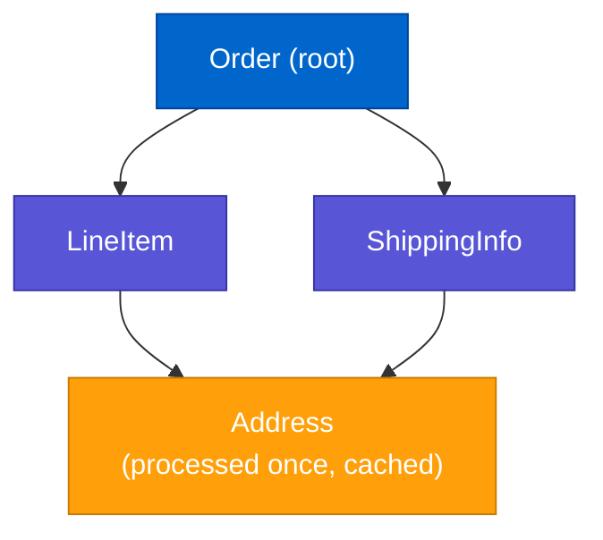
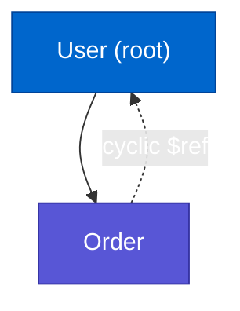

# Graph Building

Phase 3 turns the flat list of `IndexedSymbol` root models into a recursive **ModelGraph** — a directed acyclic graph (DAG) of every type reachable from each root, with inheritance resolved and polymorphic variants expanded.

## Component Architecture



## Graph Building Flow



**`processSymbol(symbol, depth)` steps:**



## Inheritance Resolution

ModelGraphGenerator tracks _where_ each property was originally declared so the JSON Schema can correctly attribute inherited fields:

```swift
class Animal {
    let name: String    // declared in Animal
}
class Dog: Animal {
    let breed: String   // declared in Dog
}
class Poodle: Dog {
    let color: String   // declared in Poodle
}
```

For `Poodle`, the graph builder:

1. Calls `getInheritanceChain("Poodle")` → `[Dog, Animal]`
2. Extracts `Dog`'s properties → `[breed]`, tagged `declaredIn: "Dog"`
3. Extracts `Animal`'s properties → `[name]`, tagged `declaredIn: "Animal"`
4. Assigns to `ModelNode.inheritedProperties`
5. `Poodle.properties` = `[color]` (own only)

The JSON Schema output then emits `allOf` with `$ref` to each ancestor.

## Polymorphic Variant Expansion

When a property has `@PolymorphicMapping`, the graph builder expands each variant type:



The converter then emits a `oneOf` with a discriminator mapping.

## Depth Limiting

The recursion depth limit (default **20**) prevents runaway expansion on pathological codebases. If a type is encountered past the limit, it is included as a terminal node without children — no data is lost for the root structure, only deep nested expansion is bounded.

```swift
guard depth < maxDepth else {
    return ModelNode(name: symbol.name, isTruncated: true)
}
```

## Graph Shape Examples

### Simple linear chain



### Shared type (diamond)



### Cyclic reference



The `CyclicNode` carries the name and schema ID but has empty children and is flagged `isCyclic: true`, so the converter emits a `$ref` back to the parent definition instead of re-expanding it.
