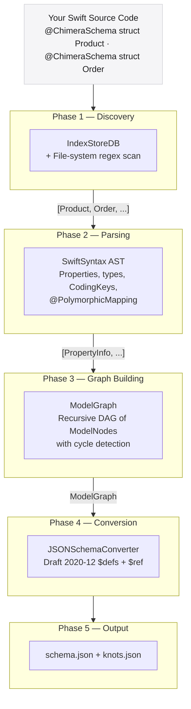

# Core Concepts

ModelGraphGenerator works through a **five-phase pipeline** that transforms annotated Swift source code into a complete JSON Schema document. This section explains the fundamental ideas behind each phase so you can reason about what the tool does — and debug it when something unexpected happens.

## The Big Picture



## Five Phases at a Glance

| Phase | Component | Input | Output |
|-------|-----------|-------|--------|
| 1 — Discovery | `DiscoveryCoordinator` | Source root + index path | `[IndexedSymbol]` |
| 2 — Parsing | `PropertyExtractor` + parsers | Swift file paths | `[PropertyInfo]` |
| 3 — Graph Building | `GraphBuilder` + `SymbolProcessor` | `[IndexedSymbol]` | `ModelGraph` |
| 4 — Conversion | `JSONSchemaConverter` | `ModelGraph` | JSON Schema object |
| 5 — Serialization | `Main.swift` | JSON Schema object | File on disk |

## Key Abstractions

### IndexedSymbol

The lightweight handle returned by the Discovery phase. It carries just enough information to locate the Swift declaration:

```swift
struct IndexedSymbol {
    let name: String    // "Product"
    let usr:  String    // Unique Symbol Resolution — "s:7MyApp7ProductV"
    let path: String    // "/path/to/Product.swift"
    let line: Int       // 14
    let kind: Kind      // .struct | .class | .enum
}
```

### ModelNode

A fully resolved node in the graph. Every non-primitive Swift type referenced by a root model becomes a `ModelNode`:

```swift
struct ModelNode {
    let name: String
    let schemaId: String?              // from @ChimeraSchema(key: "…")
    let properties: [PropertyInfo]
    let inheritedProperties: [InheritedPropertyInfo]
    let children: [ModelNode]
    let isCyclic: Bool                 // back-reference detected
    let isPolymorphic: Bool
    let polymorphicVariants: [ModelNode]
}
```

### ModelGraph

The top-level container — a flat list of root `ModelNode` trees plus metadata:

```swift
struct ModelGraph {
    let roots: [ModelNode]
    let generatedAt: Date
    let sourceRoot: String
}
```

---

## Where to go next

| Topic | Page |
|-------|------|
| How symbols are found | [Discovery System](/core-concepts/discovery) |
| How source is parsed | [AST Parsing](/core-concepts/ast-parsing) |
| How the graph is assembled | [Graph Building](/core-concepts/graph-building) |
| Cycles & shared types | [Cycle Detection](/core-concepts/cycle-detection) |
| Polymorphism & discriminators | [Polymorphic Types](/core-concepts/polymorphism) |
