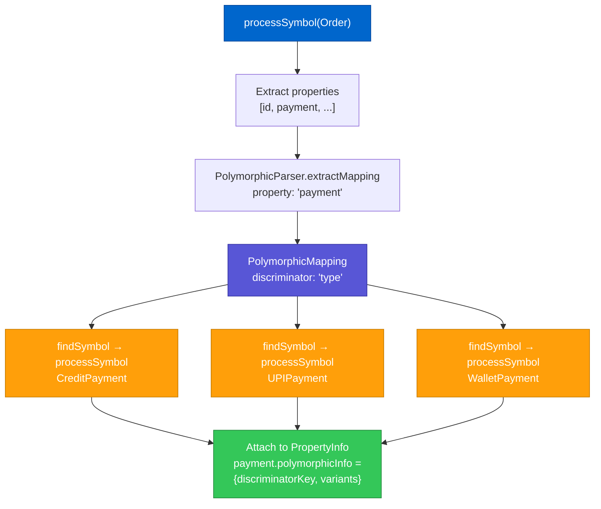

# Polymorphic Types

ModelGraphGenerator has first-class support for polymorphic properties — fields that can hold one of several concrete types at runtime, discriminated by a key in the serialized JSON.

## The Problem

A plain Swift protocol property gives no information about which concrete types can appear at runtime:

```swift
protocol Payment {}

struct Order {
    let payment: Payment   // ← could be anything
}
```

Without additional information, the JSON Schema for `payment` would just be `{}` — useless for validation.

## The Solution — `@PolymorphicMapping`

Annotate the property with the concrete types and a discriminator key:

```swift
struct Order {
    @PolymorphicMapping(
        discriminator: "type",
        variants: [
            "credit": CreditPayment.self,
            "upi":    UPIPayment.self,
            "wallet": WalletPayment.self,
        ]
    )
    let payment: Payment
}
```

ModelGraphGenerator reads this annotation and generates a `oneOf` schema with a `discriminator` block.

## Processing Flow



## Generated JSON Schema

```json
"payment": {
  "oneOf": [
    { "$ref": "#/$defs/CreditPayment" },
    { "$ref": "#/$defs/UPIPayment" },
    { "$ref": "#/$defs/WalletPayment" }
  ],
  "discriminator": {
    "propertyName": "type",
    "mapping": {
      "credit": "#/$defs/CreditPayment",
      "upi":    "#/$defs/UPIPayment",
      "wallet": "#/$defs/WalletPayment"
    }
  }
}
```

Each variant type is also fully expanded in `$defs`:

```json
"$defs": {
  "CreditPayment": {
    "type": "object",
    "properties": {
      "type":       { "type": "string", "const": "credit" },
      "cardNumber": { "type": "string" },
      "expiry":     { "type": "string" }
    },
    "required": ["type", "cardNumber", "expiry"]
  }
}
```

## Protocol Conformance Detection

As an alternative to explicit `@PolymorphicMapping`, ModelGraphGenerator can also detect polymorphism through protocol conformance when `--protocol-name` is used. In this mode:

```
findSymbolsConforming(to: "Payment")
→ [CreditPayment, UPIPayment, WalletPayment]
```

However without a discriminator key in the source, the `discriminator` block in the output will be absent — the schema validator won't know which key to switch on. Using `@PolymorphicMapping` is always more precise.

## Depth Handling

Polymorphic variants are expanded at `isPolymorphic: true` recursion frames. The depth counter for variants starts from the _parent_ property's depth, not from zero, ensuring that polymorphic types deep inside a model are still bounded by the global depth limit.

## Nested Polymorphism

A variant type may itself have polymorphic properties:

```swift
struct CreditPayment {
    @PolymorphicMapping(
        discriminator: "issuer",
        variants: ["visa": VisaCard.self, "mc": MasterCard.self]
    )
    let card: Card
}
```

This is handled naturally — `processSymbol(CreditPayment)` recursively calls the same polymorphic expansion logic on `CreditPayment`'s properties. The cycle detector prevents any loops.

## Summary

| Feature | Supported |
|---------|:---------:|
| `@PolymorphicMapping` annotation | ✓ |
| `oneOf` + `discriminator` in output | ✓ |
| Variant types fully expanded in `$defs` | ✓ |
| Protocol conformance detection | ✓ |
| Nested polymorphism | ✓ |
| Discriminator `const` in variant schema | ✓ |
| Cycles within variant graphs | ✓ |
