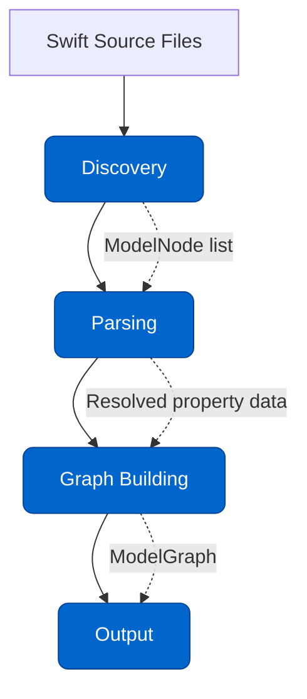

# Architecture Overview

ModelGraphGenerator is organized as a pipeline: source files go in, JSON Schema comes out. Each stage has a single responsibility and hands off its results to the next.

## High-Level Pipeline



> **Discovery** — Find `@ChimeraSchema` annotations and protocol conformances
> **Parsing** — Extract properties, enums, polymorphic mappings
> **Graph Building** — Build ModelGraph, detect cycles, resolve `$ref`s
> **Output** — Serialize to JSON Schema Draft 2020-12

## Component Map

| Component | Location | Responsibility |
|-----------|----------|---------------|
| **Discovery** | `Sources/Discovery/` | Find annotated types in Swift source |
| **Parser** | `Sources/Parser/` | Extract property/enum/polymorphic data |
| **Repository** | `Sources/Repository/` | Persistence layer for symbols and index |
| **Graph Building** | `Sources/GraphBuilding/` | Build + validate the model dependency graph |
| **Output** | `Sources/Output/` | Serialize graph to JSON Schema |
| **Core Models** | `Sources/Core/Models/` | Data structures shared across all stages |
| **Utility** | `Sources/Utility/` | File scanning, path resolution, type helpers |

---

## Core Models

All stages communicate via a handful of core data structures defined in `Sources/Core/Models/`:

### `ModelNode`

Represents a single Swift type annotated with `@ChimeraSchema`:

```swift
struct ModelNode {
    let typeName: String          // Swift type name, e.g. "Product"
    let key: String               // @ChimeraSchema key, e.g. "product"
    let description: String?      // @ChimeraMetaData description
    let properties: [PropertyInfo]
    let enumCases: [EnumCaseInfo]
    let polymorphicInfo: PolymorphicInfo?
    let sourceFile: String        // Absolute path to source file
}
```

### `PropertyInfo`

Represents a single annotated property:

```swift
struct PropertyInfo {
    let name: String              // Property name in Swift
    let type: String              // Resolved Swift type string
    let description: String?
    let isOptional: Bool
    let constraints: PropertyConstraints  // min, max, pattern, etc.
}
```

### `ModelGraph`

The dependency graph connecting all models:

```swift
struct ModelGraph {
    let nodes: [String: ModelNode]   // keyed by @ChimeraSchema key
    let edges: [String: [String]]    // key → [referenced keys]
}
```

---

## Data Flow Detail

### Stage 1: Discovery

`DiscoveryCoordinator` orchestrates two discovery strategies:

1. **MacroDiscovery** (`MacroDiscovery.swift`) — Scans Swift files for `@ChimeraSchema` annotations using SwiftSyntax visitors
2. **ProtocolDiscovery** (`ProtocolDiscovery.swift`) — Uses IndexStoreDB to find types conforming to protocols marked with `@PolymorphicMapping`

Both strategies produce a list of `ModelNode` stubs (type name + source location only; properties not yet resolved).

### Stage 2: Parsing

The Parser stage fills in each `ModelNode` with full property and structural data:

- **`PropertyExtractor`** — Visits property declarations and extracts `@ChimeraProperty` annotation data
- **`EnumExtractor`** — Extracts enum cases and raw values
- **`PolymorphicParser`** — Reads `@PolymorphicMapping` and resolves concrete type mappings
- **`CodingKeysParser`** — Respects custom `CodingKeys` enum for JSON key naming

### Stage 3: Graph Building

`GraphBuilder` constructs a `ModelGraph`:

1. Starts from all discovered `ModelNode` stubs
2. For each property referencing another model, adds a directed edge
3. `CycleDetector` runs DFS over the graph and reports circular dependencies
4. `SymbolProcessor` resolves `$ref` targets (linking property types to their `ModelNode`)

### Stage 4: Output

`JSONSchemaConverter` traverses the `ModelGraph` and emits a JSON array:

- Each `ModelNode` → one JSON Schema object
- Properties → `properties` map entries with type + constraints
- `$ref` targets resolved to `#<key>` anchors
- `required` array computed from non-optional properties
- Polymorphic types → `oneOf` arrays with discriminator

---

## Design Principles

1. **Single-pass parsing**: Each Swift file is parsed at most once
2. **Immutable data flow**: Core models are value types; stages never mutate earlier stages' data
3. **Strategy pattern for discovery**: Multiple discovery strategies can run independently and are merged by `DiscoveryCoordinator`
4. **Fail fast**: Missing `@ChimeraSchema` targets for `$ref` properties produce clear errors rather than silent omissions
5. **No runtime reflection**: Everything is static analysis at build/run time of the CLI — no Swift runtime type inspection

---

## Deep Dives

- [Discovery System](discovery-system) — How annotations and conformances are found
- [Parsers](parsers) — Property extraction and constraint parsing
- [Graph Building](graph-building) — Dependency graph, cycle detection, and `$ref` resolution
